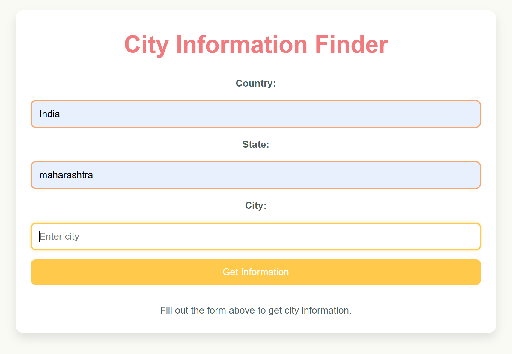
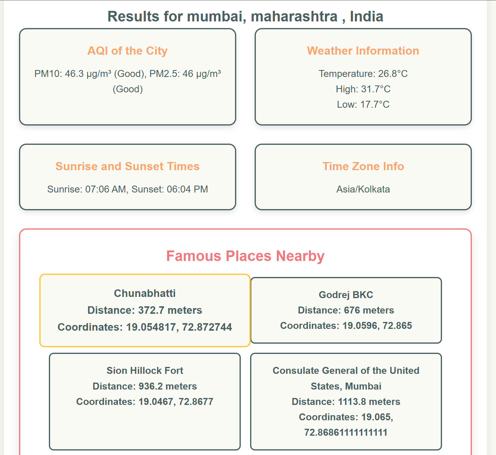

# City Information Finder 🌍

This project is a **City Information Finder** web application that fetches and displays detailed information about a city. Users can input the name of a country, state, and city, and get data including AQI, weather conditions, timezone, sunrise and sunset times, and famous places nearby.  

This application demonstrates the power of RESTful APIs and integrates multiple third-party APIs for fetching real-time data.  

---

## Features 🚀

- **AQI Data**: Displays PM10 and PM2.5 levels with health impact descriptions.
- **Weather Data**: Current temperature, daily high, and low temperatures.
- **Timezone Information**: Displays the timezone of the queried location.
- **Sunrise and Sunset Times**: Provides accurate local times.
- **Nearby Famous Places**: Retrieves notable places using the Wikipedia GeoSearch API.

---

## Why This Project is Awesome? 💡

1. **RESTful API Integration**:
   - Implements **OpenCage Geocoding API** to convert city, state, and country into geographic coordinates.
   - Uses **Open-Meteo API** to fetch weather and air quality data.
   - Integrates **Wikipedia GeoSearch API** to find famous places near the coordinates.
   - Handles multiple API responses with robust error handling.

2. **Dynamic and Interactive Interface**:
   - Built with **Express.js** for backend processing.
   - **EJS templates** for rendering dynamic content on the frontend.

3. **Scalable Codebase**:
   - Designed with middleware and modular API calls for better maintainability.

---

## Installation & Setup 🛠️

Follow these steps to set up the project locally:

### 1. Clone the Repository
```bash
git clone https://github.com/your_username/api_proj.git
cd api_proj
```
### 2. Install Dependencies
```bash
npm install
```
### Step 2: Set Up API Keys
 - Get your OpenCage API key from https://opencagedata.com/
 - Update the OPEN_CAGE_API_KEY variable in index.js with your API key.

### Step 3: Start the Server
node index.js

#### The application will run at http://localhost:3000

### Usage:
 1. Open the application in your browser at http://localhost:3000.
 2. Fill in the Country, State, and City fields in the form.
 3. Click Get Information to see:
    - Air quality data
    - Weather details
    - Timezone information
    - Sunrise and sunset times
    - Famous places nearby.

## Screenshots 📸

- Homepage:
 

- Results Page:
 

### Contribution 🤝
- Contributions are welcome!
- Feel free to submit issues or pull requests to improve the application.

### License 📜
- This project is licensed under the MIT License.

### Author ✨
 - Developed with ❤️ by Divyansh Malani.
 - "Turning data into insights, one API call"


